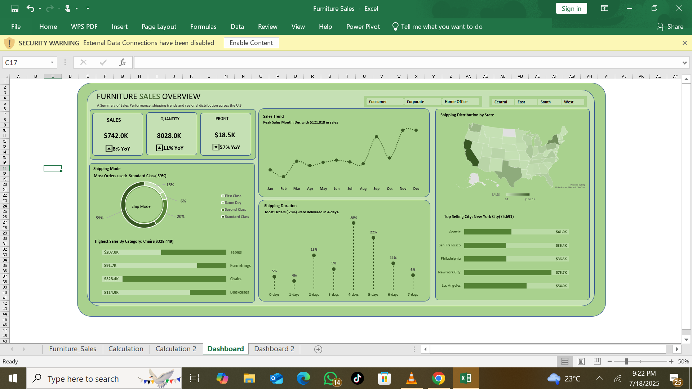
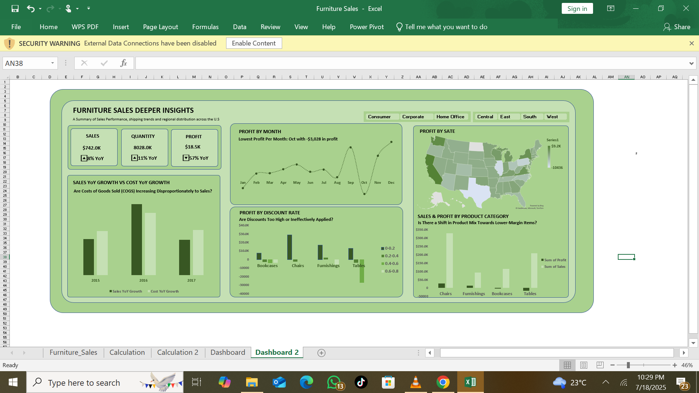

# Furniture Sales Profitability Analysis 

---
## Project Overview

This project analyzes a furniture sales dataset to understand why company profit has declined by 57% despite increasing sales and quantity. It involved creating an initial summary dashboard and then a deeper analytical dashboard to pinpoint the key drivers of this profit erosion.

---
# Dataset Overview

| Column Name | Description |
|---|---|
| Order ID | A unique identifier for each sales order. |
| Order Date | The date when the order was placed. |
| Ship Date | The date when the order was shipped. |
| Ship Mode | The method of shipment (e.g., Standard Class, First Class, Same Day). |
| Customer ID | A unique identifier for each customer. |
| Customer Name | The name of the customer. |
| Segment | The customer segment (e.g., Consumer, Corporate, Home Office). |
| Country | The country where the order was placed. |
| City | The city where the order was placed. |
| State | The state where the order was placed. |
| Postal Code | The postal code of the shipping address. |
| Region | The geographical region. |
| Product ID | A unique identifier for each product. |
| Category | The high-level product category (e.g., Furniture). |
| Sub-Category | A more specific product category (e.g., Bookcases, Chairs, Tables). |
| Product Name | The specific name of the product. |
| Sales | The total sales amount for the item(s) in that order line. |
| Quantity | The number of units sold for the item(s) in that order line. |
| Discount | The discount applied (e.g., 0.1 for 10%). |
| Profit | The profit or loss generated from the sale. |
| Duration | **(Calculated)** The number of days between Order Date and Ship Date. |
| Profit Margin % | **(Calculated)** The calculated profit margin (Profit / Sales). |
| Average Discount % | **(Calculated)** The average discount percentage applied. |
| Profit per Unit | **(Calculated)** The profit generated per unit sold. |
| Cost per Unit | **(Calculated)** The cost incurred per unit sold. |
| Month | **(Calculated)** The month extracted from the 'Order Date'. |

---
## Loading the Dataset:

I loaded the `Furniture_Sales_Deeper_Insights.xlsx - Furniture_Sales.csv` (which was originally part of a larger `.xlsx` file) into Excel using **Power Query**. During this process, I ensured:

* The correct file path and worksheet were identified.
* The first row was promoted as headers.
* All columns were correctly detected as their appropriate data types. Specifically, **'Order Date' and 'Ship Date' were correctly converted to Date data types**.

---
**Data Cleaning & Feature Engineering (via Power Query):**

After initial loading, I performed essential data cleaning and created new calculated columns directly within **Power Query** to enrich the dataset for analysis:

* **Verified Data Consistency:** Ensured values across columns were consistent.
* **Calculated Fields:** Utilized Power Query's capabilities to derive new analytical metrics crucial for understanding profitability, including:
    * **Duration:** The number of days between 'Order Date' and 'Ship Date'.
    * **Profit Margin %:** Calculated as (`Profit / Sales`).
    * **Average Discount %:** Calculated as `Discount / Sales` per line item.
    * **Profit per Unit:** Calculated as (`Profit / Quantity`).
    * **Cost per Unit:** Calculated as (`Sales - Profit`) / `Quantity`.
    * **Month:** Extracted the month number from 'Order Date' for time-series analysis.

---
## Initial Observations (Dashboard 1)

My first dashboard (in the screenshot below) provided an overview of the company's performance.

* **Total Sales: $742.0K**
* **Total Quantity Sold: 8028.0k** 
* **Total Profit: $18.5k**
* **Most Used Shipping Mode: Standard Class**
* **Highest Sales by Category: Chairs**
* **Highest Sales By Month: December with $121.818k in sales**
* **Highest Shipping Duration: 4-days**
* **Highest Sales By State: California with $156.1k in sales**
* **Top Selling City: New York with $75.7k in sales**

A critical observation was the **57% Year-over-Year decline in profit**, which prompted a deeper investigation.

---
## Problem Statement: Why is Profit Declining?

Despite healthy sales and quantity growth, the significant drop in profit indicated underlying issues. I formulated key questions to guide my analysis:

1.  **Are Discounts Too High or Ineffectively Applied?**
2.  **Are Costs of Goods Sold (COGS) Increasing Disproportionately to Sales?**
3.  **Is There a Shift in Product Mix Towards Lower-Margin Items?**
    *(Note: We also considered 'Are Operating Expenses Out of Control?' and 'Are Returns/Damages Increasing?', but the dataset was limited for direct answers to these.)*

---
## Methodology & Deep Dive (Dashboard 2)

To answer these questions, I developed a second, analytical dashboard using Excel PivotTables and charts.

---
## Dashboard 2

### Analysis 1: The Impact of Discounts 

**Question:** Are Discounts Too High or Ineffectively Applied?
**Chart Name:** Profit by Discount Range

From the Dashboard The chart clearly illustrates how deep discounts are eroding profit margins across different furniture categories.

* **Key Insight:** While discounts can drive sales volume, those above the 20% mark (0.2-0.4 range and higher) consistently lead to **significant profit losses**, particularly for **Bookcases** and **Tables**. Even for traditionally profitable items like **Chairs**, higher discounts drastically reduce their contribution. This indicates that current discount strategies are severely impacting the bottom line.

---
### Analysis 2: The Rising Cost Burden 

**Question:** Are Costs of Goods Sold (COGS) Increasing Disproportionately to Sales?
**Chart Name:** Sales YoY Growth vs. Cost YoY Growth

From the Dashboard The visualization compares the year-over-year growth rates of sales against the cost of goods sold.

* **Key Insight:** Our analysis shows that **Cost Year-over-Year Growth has consistently outpaced or kept very close pace with Sales Year-over-Year Growth**. This indicates that the cost of acquiring or producing the furniture is increasing at a rate that is consuming the gross profit, leaving less for the bottom line despite healthy revenue growth.

---
### Analysis 3: The Product Mix Problem

**Question:** Is There a Shift in Product Mix Towards Lower-Margin Items?
**Chart Name:** Sales & Profit by Product Category

From the Dashboard The chart compares the total sales volume and total profit generated by each furniture sub-category.

* **Key Insight:** While overall sales might be increasing, a significant portion of that volume comes from **unprofitable categories like Tables and Bookcases.**
    * **Tables**, despite high sales volume, generate **substantial losses**.
    * **Bookcases** also operate at a loss.
    * This indicates a problematic product mix where the business is selling more items that cost more than they bring in, directly contributing to the overall profit decline. If there has been a shift towards selling more of these unprofitable items, it further exacerbates the issue.

* The Dashboard also shows the profit by month: And it is seen that October has the lowest profit generating month with **-3,028** in profit

* The Dashboard Also shows the profit by state, and this shows **Texas** as the lowest profit generating state with **-10,436** in profit

---

## Conclusion & Recommendations

The 57% profit decline can be attributed to a combination of factors:
1.  **Over-discounting:** Discounts are frequently applied too aggressively, pushing many sales into unprofitable territory.
2.  **Escalating Costs:** The cost of goods sold is rising faster than sales revenue, squeezing margins.
3.  **Unfavorable Product Mix:** A significant portion of sales volume is derived from products that consistently generate losses (Tables, Bookcases).

**As a business owner, this analysis highlights the critical need to:**
* **Re-evaluate Discount Strategy:** Implement stricter controls on discount percentages, especially for low-margin or loss-making products like Tables and Bookcases. Consider minimum profit margins for discounted sales.
* **Optimize Cost Management:** Investigate the reasons behind increasing costs. Look for efficiencies in the supply chain, production, or logistics to bring COGS in line with sales growth.
* **Strategic Product Focus:** Shift marketing and sales efforts towards higher-profit categories like Chairs and Furnishings. Explore strategies to either significantly improve the profitability of Tables and Bookcases or reduce their sales volume.

---

## Project File Structure & Navigation
This repository contains the `Furniture Sales.xlsx` file, which houses the dataset, calculations, and dashboards used in this analysis. Here's a guide to navigate the workbook:

* `Furniture sales` worksheet: Contains the raw dataset.

* `Calculation` worksheet: Houses the PivotTable calculations that power the first dashboard (Summary Dashboard).

* `Calculation 2` worksheet: Contains the PivotTables used for the second dashboard (Deep Dive Analysis Dashboard).

* `Dashboard` worksheet: Displays the first, blue-themed Summary Dashboard.

* `Dashboard 2` worksheet: Displays the second, Deep Dive Analysis Dashboard.

* `Dashboard 2` worksheet: contain the second dashboard
